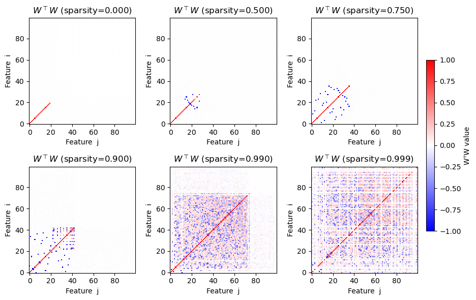

# Toy-Superposition-Replication
In this repository, I replicate the mechanistic interpretability paper [Toy Models of Superposition](https://transformer-circuits.pub/2022/toy_model/index.html) from Anthropic.

Below is an image displaying the encoded features in a simple autoencoder becoming less and less orthogonal as the model represents more (sparse!!) features than the dimension of its neuron space.

