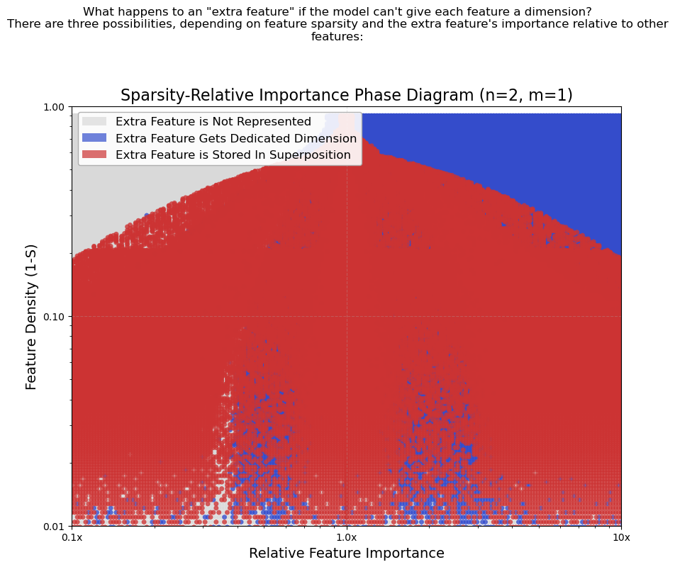

# Toy-Superposition-Replication
In this repository, I replicate the mechanistic interpretability paper [Toy Models of Superposition](https://transformer-circuits.pub/2022/toy_model/index.html) from Anthropic.

Below is an image displaying the encoded features in a simple autoencoder becoming less and less orthogonal as the model represents more (sparse!!) features than the dimension of its neuron space.

Additionally, I replicate the phase change seen in a model that represents 2 features with a single neuron. The first feature's "importance" $I_0$, which is a term that weights the feature-wise loss of the model, is fixed at 1. The second features important, $I_1$, is allowed to vary on the interval $[0.1,10]$. Additionally, we train models with varying levels of feature sparsity. The gray color represents an inner product of 0 in the weight matrix for the varied feature, meaning that the feature is not represented. The red color illustrates that the two features are stored in superposition, while the blue color signifies the varied feature getting its own dimension (the norm of the other column of the weight matrix is 0).

